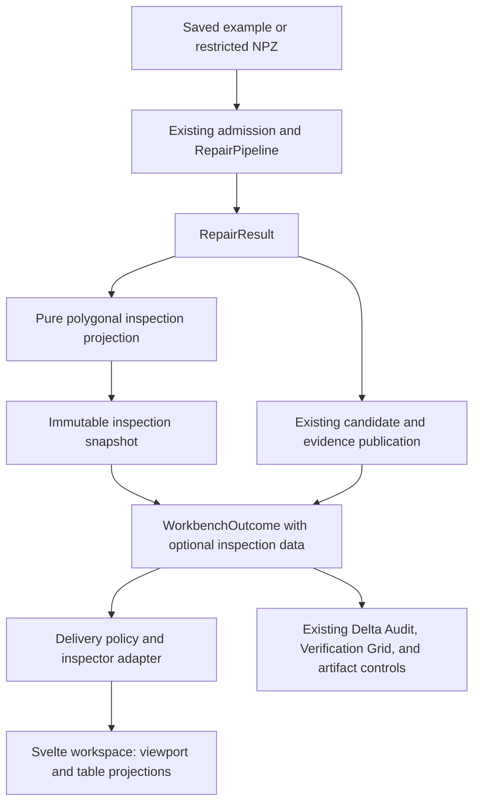

# Polygonal inspection integration — implementation plan

Status: planned; implementation has not started. This document consolidates the
accepted design decisions. Creating the plan does not authorize implementation.

## Objective

Project the existing polygonal computation results into an interactive Svelte
inspection workspace inside the Gradio parent app. Preserve the numerical workflow,
report values, source identity, and retained-artifact accounting while adding
complete entity-level inspection of the defects already reported by the backend.

The first cut covers saved examples and restricted polygonal NPZ uploads. It keeps
the existing Topological Delta Audit and Verification Grid unchanged. Native STEP
inspection, UV workflows, reconstruction, and new numerical diagnostics are outside
this slice.

Related documents:

- [Domain glossary](../CONTEXT.md)
- [Existing capabilities awaiting integration](UNINTEGRATED_CAPABILITIES.md)
- [Desired features](DESIRED_FEATURES.md)
- [Unanswered design decisions](OPEN_DESIGN_DECISIONS.md)
- [Earlier integration assessment](INTEGRATION_PLAN.md)

This focused plan supersedes the earlier report's recommendation to start with
only three overlay categories or to withhold display above the inspector's old
triangle limit. The accepted requirements are all existing defect categories and
the parent's full accepted input range before replacing its polygonal display.

## Existing implementation and integration gaps

| Existing module | Current responsibility | Integration gap |
| --- | --- | --- |
| [`RepairPipeline` and `RepairResult`](../src/cad_integrity/pipeline.py) | Compute original/candidate geometry and before/after reports | Keep computation unchanged; project its results without rerunning analysis |
| [`TopologyReport`](../src/cad_integrity/topology.py) | Retain defect entity IDs and topology evidence | The inspector adapter currently exposes only part of this evidence |
| [`PolyhedralBRep`](../src/cad_integrity/models.py) | Own polygonal topology and guarded convex-face triangulation | Current triangulation fails the whole call on one unsupported face and returns no source-face map |
| [`_polygonal_analysis_outcome`](../src/cad_integrity/gradio_app.py) | Combine evidence, figures, candidate publication, and release | Add a pure inspection projection and keep publication decisions separate |
| [`WorkbenchOutcome`](../src/cad_integrity/workbench_results.py) | Carry completion, checks, brief, release, and figures | Add optional typed inspection data without replacing the controller result |
| [Existing host-report adapters](../integration/mesh-diagnostics-seam/python/cad_mesh_inspector/adapters.py) | Project supplied reports into inspector payloads | Reuse behavior, extend identity and coverage, and avoid a second audit |
| [Inspector contract and selection](../integration/mesh-diagnostics-seam/src/core/selection.ts) | Resolve revision-scoped triangle/category/path targets | Add actual vertex, edge, and polygonal-face targets; do not relabel triangle IDs as source faces |
| [Inspection workspace placeholders](../components/inspection_workspace/README.md) | Reserve proposed Svelte module locations | They have no runtime implementation or package wiring |

The parent upload currently permits 250,000 vertices and 500,000 triangles, subject
to its other admission limits. Inspector v1 permits only 250,000 triangles per
mesh. Raising a constant alone does not qualify the larger workload.

## Accepted architecture

### One immutable inspection snapshot

The parent owns a renderer-independent inspection result: an immutable snapshot
of the data needed for browser inspection. The viewport and tables are visual
projections of the same snapshot.

The snapshot contains the geometry, entity identities, diagnostic memberships,
display-to-source mappings, coordinate frame and units, and display issues needed
to inspect the result without further backend lookups. Original and Candidate
have separate identities and revision-scoped entity namespaces, even when their
geometry happens to match.

No mutable computation objects, renderer objects, or lazy backend selection
lookups belong in this result. Immutability must include owned array data and
collections, not merely a frozen outer object with mutable aliases.

Camera, clipping, filters, hover, picking mode, and selection are separate mutable
browser state. They do not modify the snapshot. Runtime snapshots are in scope;
retaining and reopening downloadable snapshots is deferred under F-002.

### Additive controller result

Keep `WorkbenchOutcome` as the controller result and add optional typed inspection
data. Preserve existing checks and release handling. STEP leaves the new data
empty for this cut; its numerical and display workflow is not being migrated.

The exact type names and field layout are implementation-design work. Keep the
inspection data distinct from `DecisionBrief.dashboard_data` and renderer-specific
figure fields. Do not recover it by reading back Plotly figures or candidate NPZ
files after source topology has already been lost.

### Pure projection and a frontend adapter

The projection owns geometry derivation, entity mapping, diagnostic association,
and structured display issues. It does not repair geometry, run a second topology
audit, write artifacts, or decide candidate publication policy.

The adapter translates the parent snapshot into a deliberately versioned frontend
payload. Existing inspector v1 is not sufficient for all accepted semantics.
Preserve existing public seams through compatibility adapters where necessary;
do not silently change the meaning of an existing triangle-based target.

Final delivery combines publication facts and inspection availability. In
particular, D-001 must be resolved before finalizing behavior when candidate-file
publication fails. Keeping a computed snapshot and deciding whether to expose it
are separate responsibilities.

## Geometry, diagnostics, and identity

### Complete existing defect coverage

Visualize every category already reported by `TopologyReport`:

| Entity kind | Categories |
| --- | --- |
| Vertex | Nonmanifold vertices; unused vertices |
| Edge | Boundary edges; nonmanifold edges; winding conflicts; unused edges; collapsed edges |
| Polygonal face | Invalid faces; duplicate faces |

Project supplied category memberships and counts. Do not infer additional defects
from display behavior or add triangle-quality computation to this slice.

An entity may belong to multiple categories. Preserve each membership and its
category count. Deduplicate by mesh identity, revision, entity kind, and entity ID
when highlighting a combined group or computing a unique affected-entity count.
This does not introduce arbitrary multi-selection, which remains deferred.

Every reported entity must be individually selectable from the diagnostic table,
including coincident entities that cannot be distinguished by viewport clicking.
Collapsed edges need a selectable display representation even when their endpoints
occupy one position; the representation must not change the source geometry.

### Face-level inspection and partial rendering

The selectable face is the source **polygonal face**, not a display triangle.
Clicking any triangle selects its owning face and highlights all triangles that
represent it. The triangulation implementation owns the emitted triangle-to-face
map; callers must not independently predict triangle order.

Triangulate faces independently. If one face cannot be triangulated, render other
faces normally and show the affected face through its original vertices and edges,
with its interior unfilled. Preserve source IDs; do not invent replacement surfaces
or let one unsupported face erase the whole model.

For malformed face connectivity, retain the entity and its reported classification
and expose only geometry that can actually be resolved. Do not fabricate a closed
boundary from invalid references. Record unresolved display data as a display issue.

Display issues are separate from computed mesh defects. For example, a valid
concave polygon unsupported by the current triangulator is not thereby a topology
defect. Display failures must not alter topology counts or verification states.

### Original versus Candidate

Selections remain independent. Equal indices in different mesh revisions do not
establish correspondence. Explicit correspondence through modification is F-001;
existing operation-level weld maps are useful groundwork but are not a complete
workflow map.

Shared camera and clipping controls operate in the common coordinate frame. They
do not imply entity correspondence.

## Accepted browser behavior

| Concern | Current-cut behavior |
| --- | --- |
| Layout | Original and Candidate side by side; either viewport can be explicitly maximized |
| Missing candidate | Leave the candidate pane vacant; no automatic panel resizing (D-002) |
| Initial active pane | Original |
| Active pane | Clicking a viewport makes it active; shared entity and metric tables show that mesh and explicitly identify Original or Candidate |
| Camera | Linked comparison cameras; hover and selection never move them automatically |
| Clipping | Linked by default, with an explicit unlink control |
| Clipping and diagnostics | Clipping does not filter diagnostic rows, change counts, or clear selection; selection does not silently move clipping planes |
| Depth | Normal depth visibility by default; explicit X-ray reveals obscured defect overlays |
| Initial overlays | All reported categories at restrained intensity; selected category/entity emphasized |
| Category visibility | Can reduce overlay clutter without changing diagnostic counts |
| Entity coverage | Every entity inspectable; Defects only filter enabled initially |
| Picking mode | Explicit Vertex / Edge / Face mode shared across both panes |
| Changing picking mode | Preserve current selection; the mode affects subsequent viewport picks |
| Table selection | May select any entity kind regardless of viewport picking mode |
| Selection cardinality | One individual entity or one whole category per viewport; a new selection replaces that pane's previous selection |
| Pane switching | Preserve each pane's independent selection |
| Category filter | Shared between panes; switching panes preserves the category and shows that mesh's count, including zero |
| Selection outside filter | Keep it selected and visible with muted emphasis |
| Selected-entity row | Remains above the filtered table with entity ID and a clear control; muted when outside the filter |
| Focus | Explicit Focus selection action; ordinary selection does not reposition the camera |
| Hover | Temporary visual preview; leaving the row restores pinned selection; clicking replaces it |
| Locality | Hover, selection, camera, clipping, and filtering stay browser-local, with no Gradio callback or numerical recomputation |

Hover and selection updates must not rebuild geometry, reset viewport state, or
disturb clipping/camera settings. Fine-tune emphasis and timing in the running
visualization. They are visual adjustments, not changes to computed data.

Use names, numbers, units, status indicators, and selectable rows. Do not insert
explanations, disclaimers, or cautionary notices into data fields or captions.
Retain detailed provenance and diagnostic explanations in evidence or dedicated
metadata presentation. Actual unavailable/error states remain explicit.

## Current-cut execution rules

Starting a newly admitted computation immediately clears the previous displayed
results: geometry, overlays, diagnostic rows, reporting values, selections, and
download references. Failure must not resurrect the old result. Clearing UI values
does not delete retained artifact files.

Only one computation may be active per browser session. Enforce this at request
admission as well as by disabling computation-start controls. An overlapping
request that is not admitted must not clear the active run's state. Release the
admission guard on success and failure.

Proposed implementation detail: refuse duplicate starts while the session is busy
rather than introducing a queue in this cut. The accepted requirement is one
active computation; exact duplicate-request handling is to be specified during
implementation design.

Apply the session rule consistently to computation-start routes in the parent,
including when changing tabs; it must not be bypassable by starting a different
workflow in the same session. This does not migrate STEP's result schema or
numerical implementation. It is not a global single-computation limit.

The minimal clear/start/finish behavior is in scope. Rich result lifecycle,
cancellation, supersession, overlapping runs, and cross-session resource management
remain F-003 and F-004. F-004 follows F-003.

## Delivery slices

The locations below identify responsibilities and likely edits, not finalized
type signatures or a requirement to copy package layouts unchanged.

### 1. Define the inspection data model and additive outcome seam

- Add a backend-owned inspection model under `src/cad_integrity/`, independent of
  Gradio, Plotly, Three.js, and the inspector wire schema.
- Represent original/candidate stages, revision-scoped vertices/edges/faces,
  category membership, display triangles and mappings, and display issues.
- Extend `WorkbenchOutcome` additively; account for existing construction paths,
  including failed and incomplete outcomes and STEP's empty inspection value.
- Establish deep immutability and explicit coordinate/unit ownership.

Acceptance: a complete result can be inspected without backend follow-up; mutation
cannot leak through shared array aliases; existing controller and release behavior
remains unchanged. Source byte hashes are not confused with geometry revisions.

### 2. Implement pure polygonal projection and partial display geometry

- Consume `RepairResult` and its existing reports for both controller paths.
- Emit all reported defect categories and entity-target mappings.
- Add per-face display triangulation with provenance and local failure results,
  preserving the existing triangulation interface for current callers.
- Preserve boundary/point display for unsupported faces and degenerate entities.
- Preflight geometry and payload counts before allocating flattened copies.

Acceptance: counts and memberships match supplied reports; mixed polygons retain
correct mappings; one failed face does not hide valid faces; source arrays remain
unchanged; no duplicate audit or file I/O occurs.

### 3. Evolve the inspector adapter and rendering targets

- Define the versioned wire representation for the accepted inspection model.
- Extend target resolution and picking to vertices, edges, and polygonal faces.
- Reuse the existing viewport, resource ownership, camera linkage, clipping, and
  diagnostic rendering implementations where they fit.
- Keep one renderer owner per viewport. The neon error overlay belongs to a
  dedicated rendering module within GeometryViewport, consuming backend targets.
- Preserve existing package interfaces with adapters; retain reference sources.

Acceptance: backend-produced fixtures validate in the browser; source-face picking
selects all corresponding triangles; zero-area/overlapping entities remain
addressable through the table; stale revision targets cannot resolve.

### 4. Compose the Svelte inspection workspace

- Implement the GeometryViewport, MetricTable, and EntityTable responsibilities
  with a shared browser inspection-state owner and the agreed controls.
- Use the reserved inspection workspace as a provisional composition location;
  shared-library packaging can be settled without changing the behavior above.
- Implement side-by-side layout, explicit maximize, active-pane tables, persistent
  per-pane selection, shared filters/mode, hover preview, muted retained selection,
  linked clipping with unlink, X-ray, and explicit focus.
- Leave ScalarControls, ScalarLegend, UVViewport, TraceTable, PrimitiveTree, and
  unrelated operation functionality unimplemented unless required by this scope.
  Placeholder presence is not a commitment to implement every module in this cut.

Acceptance: browser behavior matches the table above, including filter changes,
empty categories, missing candidate, maximize/restore, and stable hover updates.

### 5. Integrate Gradio delivery and session admission

- Package/register the actual workspace frontend using the existing local Gradio
  build conventions; use installed package imports, not source-path injection.
- Feed the parent inspection result through its adapter for examples and uploads.
- Keep the existing reporting modules and artifact controls; clear and populate
  their values together with the relevant inspection result.
- Implement immediate result clearing and session-level single admission, with
  controls restored after failures as well as success.
- Resolve D-001 before finalizing candidate visibility on candidate-write failure.
  Do not treat the earlier recommendation as an accepted decision.

Acceptance: actual parent-controller results reach installed frontend assets;
checks and retained paths remain correct; a needs-review candidate is not hidden
merely for failing a check; late evidence failure preserves already retained files.

### 6. Qualify capacity and switch polygonal display

- Qualify the parent's full accepted range, including two simultaneous views,
  dense defect overlays, entity tables, picking, and repeated result replacement.
- Measure payload size, peak memory, load/update time, and interaction behavior
  on the target local environment. Choose concrete performance thresholds before
  declaring qualification; no numerical latency or frame-rate target is agreed yet.
- Cover resize, explicit maximize, context loss/restoration, disposal, and hover
  stability without geometry reconstruction.
- Retain the existing polygonal display path until coverage and capacity qualify.
  If qualification fails, fix that gap before switching; do not silently reduce
  upload admission, drop entities, or decimate away diagnostic identity.

Acceptance: the integrated inspector supports admitted source/candidate workloads
within documented resource bounds. STEP display remains unaffected. Numerical
tests, parent integration tests, and real browser evidence are reported separately.

## Verification matrix

| Area | Required evidence |
| --- | --- |
| Backend projection | Supplied reports projected exactly; no rerun; immutable data; units/frame retained; all categories represented |
| Provenance | Mixed triangles and larger polygons; changed orientation; stable source-face IDs; source/candidate namespace separation |
| Partial geometry | Unsupported/nonplanar/self-intersecting display faces; valid neighboring faces still rendered; malformed references not invented |
| Entity inspection | Coincident duplicate faces, collapsed edges, unused vertices/edges; individual table selection and proper category counts |
| Browser state | Pin/hover restoration, hidden-selection muting, shared mode/filter, independent pane selections, explicit focus, clipping and X-ray |
| Runtime stability | No hover-triggered geometry rebuild; repeated loads, resize, maximize, disposal, initialization failure and context recovery |
| Parent lifecycle | Clearing on admitted start; overlapping execution prevented; controls recover after error; no stale result restoration |
| Release semantics | Source staging failure; candidate needing review; later evidence failure; D-001 behavior after it is resolved |
| Capacity | Parent admission range in both panes; all entities remain reachable; no arbitrary table cap that hides entities permanently |
| Regression | Existing numerical, report-projection, admission, and artifact tests; installed-parent browser checks rather than standalone-only evidence |

Tests exercise observable behavior through module interfaces. Keep meaningful
numerical and release tests; change renderer-specific assertions only as the
renderer migration requires. No capability, interface, or test is removed solely
because it currently has few callers.

## Deferred work and unresolved choices

| Register item | Disposition |
| --- | --- |
| Triangle quality and scalar fields | Existing capabilities, not part of this topology-projection slice |
| F-001: mesh correspondence | No automatic cross-mesh selection; equal numeric IDs are insufficient |
| F-002: retained snapshots | Runtime immutable snapshot only; no new snapshot export/reopen workflow |
| F-003: computation/result lifecycle | Clear old results immediately; richer state management deferred |
| F-004: concurrency management | One active computation per browser session; broader policy deferred |
| F-005: multi-selection | One entity or one whole category per viewport |
| F-006: picking shortcuts | Explicit mode control only; keyboard bindings deferred |
| D-001: candidate-file write failure | Unanswered; blocks finalizing that behavior and its acceptance tests, not independent projection work |
| D-002: no-candidate layout | Vacant candidate pane, no automatic resizing; explicit maximize retained |

Exact backend types, wire encoding/version, package placement, and performance
thresholds remain implementation-design work. These choices must satisfy this
plan rather than introduce new product scope. Glow styling and interaction timing
remain visual tuning work with stability checks.

## Completion criteria

The slice is complete when both polygonal entry paths deliver the immutable parent
inspection result to the installed Svelte workspace; all reported defect categories
and all mesh entities are inspectable; the agreed interaction and execution rules
hold; D-001 is resolved and verified; the parent admission range is qualified; and
the existing reporting and artifact behavior is preserved.

Update integration documentation and artifact manifests with implementation
evidence when that work is performed. This planning change does not establish
test, browser, capacity, or runtime qualification.
